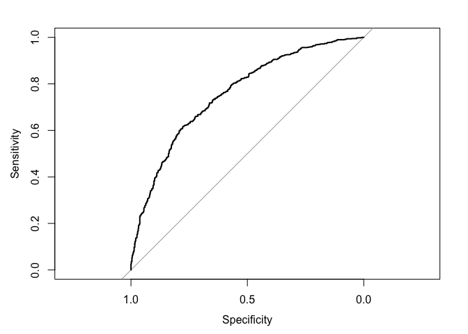

``` r
library(tidyverse)
library(glmnet)
library(xgboost)
library(pROC)
```

``` r
# Download the appropriate data
data = read_csv('data/moneyline_data.csv', show_col_types=F)
```

``` r
# Split the data into training and testing sets
set.seed(05152024)
train_idx = sample.int(nrow(data), nrow(data)*0.8)
train = data[train_idx,]
test = data[-train_idx,]
```

``` r
# Fit a lasso logistic regression model with cross-validation to select lambda
X = makeX(select(train, -winner), select(test, -winner))
model = cv.glmnet(X$x, train$winner, family='binomial', alpha=1)

# Predict the test set
y_pred = predict(model, s='lambda.min', newx=X$xtest, type='response')

# ROC
roc = roc(test$winner, y_pred, levels=c(0, 1), direction='<')
plot(roc)
```

<!-- -->
